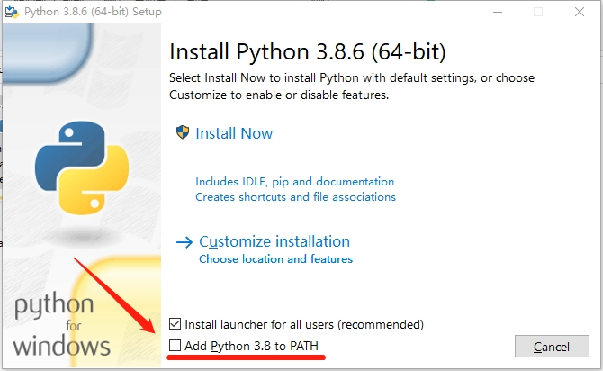
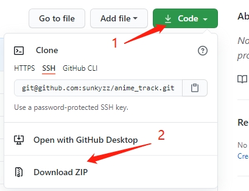
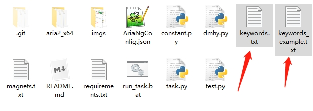
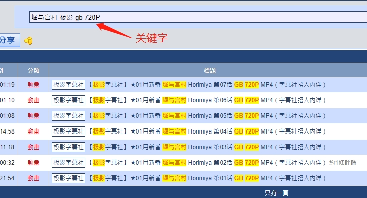
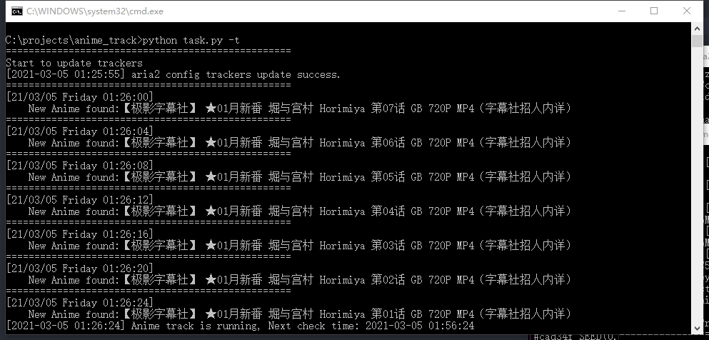
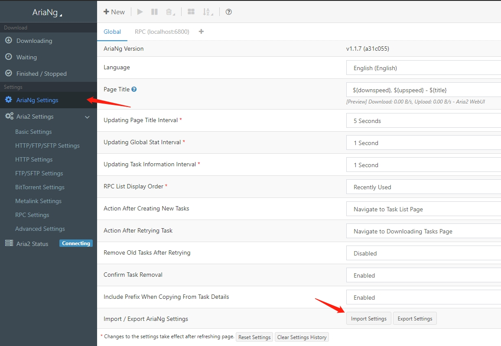

# Anime Track

一个在新番更新后第一时间自动下载的小工具.

可以根据**自定义的关键字**在dmhy等BT下载站在搜索结果更新时将磁力链发送至aria2实现自动下载.

基本功能包含:

1. 将BT下载站的某个关键字的搜索结果的所有磁力链添加至ARIA2
2. 自动更新aria2 trackers
3. 将已添加的磁力链添加至`magnets.txt`避免重复下载
4. 周期性检查搜索结果有没有更新(默认检查时间间隔为30分钟一次)

# 使用方法

如果你对于Python或者Linux有一定了解, 建议直接跳转到[使用说明](#使用说明).

确保你已经安装了[Python3](https://www.python.org/ftp/python/3.8.6/python-3.8.6-amd64.exe), 并且**勾选**了`Add Python 3.x to PATH`这一项.



点击Code - Download ZIP下载压缩包



解压压缩包后, 双击 `keywords.txt` 以及 `keywords_example.txt`



按照`keywords_example.txt`的格式, 将你希望下载的关键字以及下载路径, 例如`堀与宫村 极影 gb 720P,D:\动画\堀与宫村`添加到`keywords.txt`, 使用 `,` 隔开关键字以及路径(确保`,`为半角字符以及前后不要有空格), 如果有多条记录, 请另起一行.



保存 `keywords.txt`.

`keywords.txt`的基本格式为

```bash
搜索关键字,下载地址,网站(目前可以省略)
```

双击 `run_task.bat` 运行, 会启动两个窗口, 如无意外可以看到类似这个的界面.



aria2的访问建议使用 [http://aria2.net/#!/new](http://aria2.net/#!/new)

选择AriaNg Setting - Import Setting 导入 `AriaNgConfig.json` 即可.



如果有任何问题或者修改建议, 请在 [**Isuue**](https://github.com/sunkyzz/AnimeTrack/issues/new) 内留言.

# 使用说明

其实就是个根据RSS的XML解析后丢到ARIA2的爬虫, 自带一个已经调试好的Windows aria2c, 兼容Linux和MacOS, 只不过需要手动启动aria2以及python文件.

`magnets.txt` 文件内是已添加过任务的hash值, 你可以手动添加不想下载的任务, 可以删除以清空记录, 程序会创建一个新的空文件.

`keywords.txt` 支持相对路径及绝对路径, 支持Windows和Unix两种路径表达方式, 当指定了不存在的路径时会尝试创建, 创建失败或者无法读取的记录则跳过这一行.

`constant.py` 包含了一些程序依赖的常量, 例如你可以指定其他路径的 `keywords.txt` 或者 `magnets.txt`

`task.py` 启动文件, 需要python3.6及以上版本, 并且安装 `requirements.txt` 内的依赖.

`task.py` 启动参数

| 参数 | 说明                                                                             |
| ---- | -------------------------------------------------------------------------------- |
| `-f` | 仅将任务添加至 `magnets.txt` 而不下载, 用于避免重复下载.                         |
| `-t` | 每次启动更新aria2的trackers, 如果提示update fail可以在aria2.conf文件内手动更新它 |
| `-o` | 关闭循环检查, 检查一次即退出, 可以用于开机自启或者任务计划.                                                     |

aria2的默认Token为 `ANIME_TRACK`, 如果你启动了自己的aria2或者在aria2的配置文件修改了它, 请在 `constant.py` 内修改`aria_token` 这一项

# FAQ

Q: 支持哪些网站?

A: 暂时只支持dmhy, 如果你需要其他网站, 请提 [**Isuue**](https://github.com/sunkyzz/AnimeTrack/issues/new), 我有空会做的.

<br>

Q: 网站提示523 or 无法获取搜索结果.

A: 通常是暂时性抽风, 如果好几天都无法获得搜索结果, 请提 [**Isuue**](https://github.com/sunkyzz/AnimeTrack/issues/new).

<br>

Q: 为啥用txt这么智障的格式.

A: 单纯为了使用方便罢了, 应该不会出现性能上的瓶颈就这样吧...

<br>

Q: 下载解析失效 & 有BUG & 有使用问题 & 有想法

A: [**Isuue**](https://github.com/sunkyzz/AnimeTrack/issues/new)